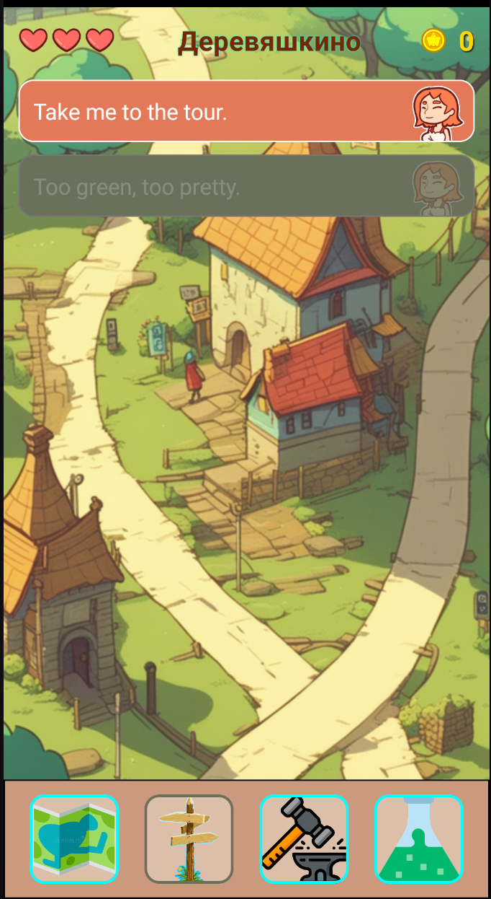
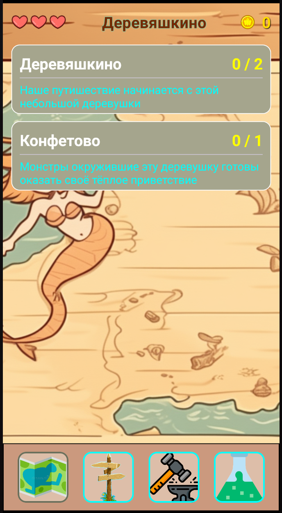
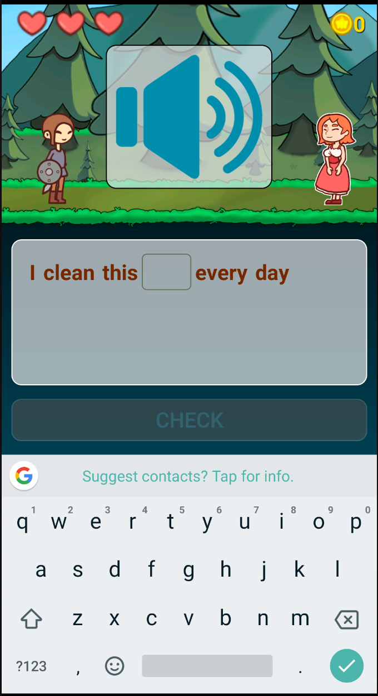

### Fitness Terra

  
  
  
  
  

## About The Project

Application for learning different languages.

## Built With

Kotlin
Android studio
Jetpack compose

## Getting Started

Just open this project at Android studio